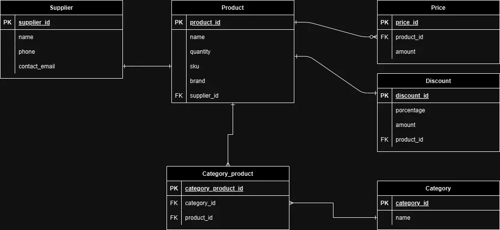

# Inventario de productos con Django
## Un proyecto que integra, Python, Django, Postgresql, Bootstrap 5 y JS puro, es un MVC, con templates de Django. Se usan tags como , , , se tienen 3 modelos hasta el momento el cual se adjunta imagen de diagrama entidad relación, con modelo producto y precio se tiene un CRUD hasta el momento.
---

